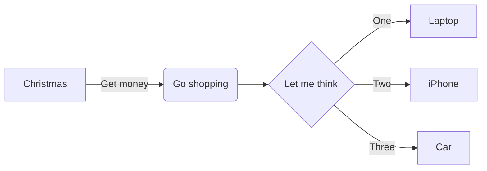

Actors in the [actor model](https://en.wikipedia.org/wiki/Actor_model) are objects which encapsulate state and behavior, they communicate exclusively by exchanging messages which are placed into the recipient’s mailbox. In a sense, actors are the most stringent form of object-oriented programming, but it serves better to view them as persons: while modeling a solution with actors, envision a group of people and assign sub-tasks to them, arrange their functions into an organizational structure and think about how to escalate failure (all with the benefit of not actually dealing with people, which means that we need not concern ourselves with their emotional state or moral issues). The result can then serve as a mental scaffolding for building the software implementation. One actor by itself is not very useful, however many actors working with a common purpose can be rather fruitful.

Akka.net is just an implementation of an actor sytem that fascilitates the actor model. Go to [akka.net](https://getakka.net/)'s website to get familiar with their implementation of the actor model. To use Akkatecture even more effectively, we suggest that you go on further and complete the [petabridge akka bootcamp](https://github.com/petabridge/akka-bootcamp). It is a good way to get a solid understanding of akka.net, and how it works.

[Next, Configuration →](/docs/configuration)